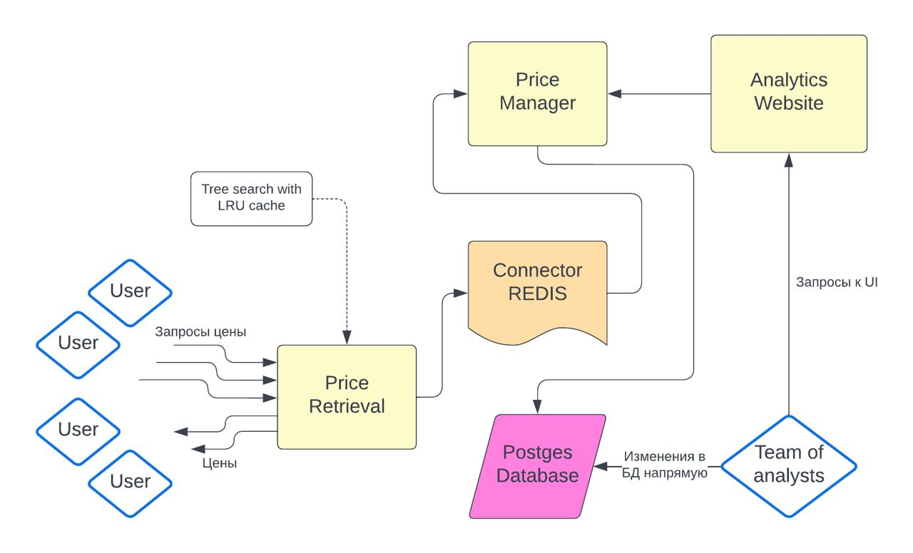

# Платформа ценнообразования Авито
## Решение трека Avito от команды: calcaulas enj
1) Backend - golang
2) Frontend - html + golang(backend requests)
## Фишки:
1) User Interface для аналитиков с возможностью изменять значение в матрице, получать название матриц, менять матрицы(baseline_matrix_1 -> baseline_matrix_2) в качестве основной
* Возможность работать со скидочными матрицами и их добавления в сервис
2) Сервис сбора метрик(количество пользователей/какие ответы, локации)
3) Оптимизированная работа с таблицами возврата цен
4) Использования Redic system для быстрого ответ пользователю

## UI
TODO описание сервиса\

## Архитектура решения кейса:
1) MultiUser price_retrieval - сервер, позволяющий получать стоймость по локации и категории для пользователей
2) MultiUser price_management - сервер, 'общающийся' с таблицами, созданный для ответ на запросы retrieval сервера, а также API для аналитиков, позволяющий менять цены в таблицах, обновлять таблицы(baseline, discount tables name)
3) MultiUser price_ui - сервер для аналитиков с ui, который позволяет проводить манипуляции с текущими таблицами и получать информацию(подробнее ниже)
## Оптимизации:
1) Используем кеширование на пути дерева (категорий, локаций), оптимизация отлично себя показала на нагрузочных тестах увеличив RPS с 85 до 350, кеш мы чистим при изменении исходной таблицы или раз в полчаса как написано ниже(с указанием причины).
*** также дерево поиска сначала проверяет приоритетные таблицы(с дисконт сегментами для uiserid, ведь при старте нашего сервиса мы парсим JSON с userami и скидочными таблицами для них)

2) разделение таблиц, это оптимизация дает на больших обьемах данных ускорение, тк мы на каждый запрос ищем в таблице размером в 20 раз меньше, а еще и часть закешировано из самых частых запросов. В этой части мы делим таблицу по microcategory_id, мотивация ниже, но также имеем возможность в два действия изменить matrix_size, и делить таблицу на matrix_size элементов(сейчас тесты подобраны чтобы делить на интересные нам таблицы), в реальном проде на +- равные таблицы и когда много set_price добавлено делаем перебалансировку(ночью например)

3) Для каждого пользователя мы знаем json|матрицу скидочных категориий, и мы его выгружаем при создании price_retrieval. Таким образом когда мы делаем запрос для пользователя мы уже за O(1) знаем надо ли нам ходить в Discount сегмент или нет. Это достаточно сильная оптимизация, тк если для пользователя нет скидок, то и смысла ходить нет, а такое обычно у большинства.

4) делаем легкий запрос без json:
Пользователь к нам всегда приходит с 3-4 параметрами microcategory, location, data_base_id, price, где data_base_id создан для удобства аналитиков чтобы не писать название какую матрицу они меняют(в UI показывается json - matrix_name|id)

5) используем оптимизированные API у нас сервера слушают асинхронно пользователей, поэтому имеется возможность в MultiUser обращения.

## Описание работы алгоритма(подробно):
1) Пользователь для получения цены задает запрос в сервис price_retriver, дальше мы идем по location_tree и microcategory_tree
2) Применяя алгоритм подьема с оптимизацией в виде кеширования на пути, те если мы получили ответ в i вершине, а начали в j, то кешируем все на пути с j по i.
3) Если вершина была в кеше, то возвращаем ответ и не поднимаемся дальше. В качестве кеша используем NoSQL систему Redis, тк она наиболее быстрая и идеально подходит для нашего дерева, в котором более 250'000 вершин. 
** Сам кеш мы чистим раз в N минут, которое передается через конфиг, чтобы убрать из системы старые вершины, в которые давно никто не ходил.
4) Если запрос не в кеше, мы его туда положим на всех вершинах в пути, в процессе возвращения ответа. А пока его там нет идем в connector, который кеширует дерево, и отправляет запрос в сервис, общающийся с DataBase.
5) Запрос попадает в сервис price_manager по ручке get_price, по https запросу, в котором передается всего 3 аргумента в запросе, так что тут тоже оптимизация в отличии неэффективного JSON
6) Внутри сервиса стоит наша главная оптимизация, тк исходная baseline_matrix очень большая, то и поиск по ней происходит долго, мы разбиваем ее на матрицы(которые тоже создаются в нашем сервисе) меньшего размера(в среднем если исходная матрица 250к строк, то дополнительные максимум 25к строк), сильно уменьшать и разбивать тоже плохо, тк над DataBase построена целая архитектура, которая требует памят, поэтому разбиваем на матрицы размера ~5-max(10)% от исходной матрицы(для тестовых матриц, для продовых в конфиге пишется matrix_size - максимальный размер матрицы).
7) Внутри самого сервиса мы однозначно умеем сопоставлять за O(1)(за счет matrix naming) имя матрицы, в которую отправить запрос и таким образом мы имеем возможность для всех запросов поиска цены ходить в оперделенную матрицу.
**Разбитие на матрицы происходит по параметру microcategory_id, тк размерность дерева этого параметра~совпадает с размерностью дерева локаций а общая таблица представляет из себя их декартово произведение(в общем случае)
8) Как только к нам пришел элемент мы по цепочке как показано отдаем пользователю, все клиенты к обоим серверам подключаются асинхронно и с помощью стресс тестов мы смогли замерить RPS нашей системы. На всех этапах мы передаем небольшие запросы и лишь ответ пользователю собираем в виде JSON файла. Тк нам от price_management важно лишь получение цены, те 1 число.
\
\
**НИЖЕ ПРЕДСТАВЛЕНА СХЕМА РАБОТЫ СЕРВИСА**
\
\

## Не функциональные требования:
1) Сервис масштабируется, тк в нем несколько микросервисов связанных между собой исключительно API, не знающих о внутреннем устройстве друг друга, а также внутри сервисов нет "magic const" и захардкоженных map, вместо этого в config сервера пердаются названия Jsom файлов, где собрана основная ифнормация(при желании имеется возможность JSON заменить на YAML|SQL|NoSQL), но для тестирования с небольшим числом userов это идеальный вариант.
Также тут собирается полный лог ошибок при запросах и обработке, что может помочь в дебаге и масштабируемости.

2) Сервис доступен почти все время за исключением нескольких минут на обновление таблиц пользователей и сброс кеша, что происходит редко.

3) Сервис устойчив к потере датацентров, тк каждая функция берет таблицы и если не получает ответ на запрос переходит к другой, в этом месте имеем возможность вписать очередность запроса к Data Center

4) Отдача как показывают stress test для 99.9% пользователей происходит менее чем за 200мс

5) Сервис также крутится на машине, и любые ошибки его не убьют, тк они обрабатываются, а ппользователю вернется лишь отсутствие ответа. В остальное время он доступен

## Запуск:
Подробный README по запуску компоненты находится в каждой папке сервиса(названия соответсвующие)
1) price_retrieval - сервис получения цен для пользователей
2) price_management - сервис работы с базой данных, отвечающий за запросы аналитиков и выдаче по запросу get_price(тема кейса)
3) price_ui - сервис для аналитиков с GUI
4) data_base_generation - скрипты для создания тестовых DataBase(там 3 таблицы discount segmenta и 3 таблицы baseline_matrix для теста корректности)