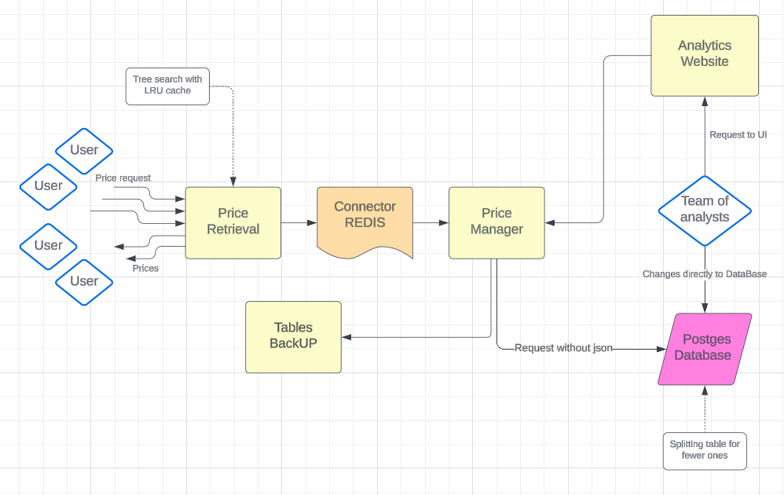

# Платформа ценообразования Авито

## Решение команды Calculus Enjoyers
`Backend` - _Golang_

`Frontend` - _HTML_/_CSS_/_JavaScript_

`Test` - _Python_

# Содержание
- [Платформа ценнообразования Авито](#платформа-ценнообразования-авито)
  - [Решение команды Calculus Enjoyers](#решение-команды-calculus-enjoyers)
- [Содержание](#содержание)
- [Technologies \& Tools](#technologies--tools)
- [Фишки](#фишки)
- [UI](#ui)
- [Архитектура решения кейса](#архитектура-решения-кейса)
  - [Диаграмма работы сервисов](#диаграмма-работы-сервисов)
  - [Оптимизации](#оптимизации)
  - [Алгоритм get\_price (подробно)](#алгоритм-get_price-подробно)
- [Не функциональные требования:](#не-функциональные-требования)
- [Тестирование продукта](#тестирование-продукта)
- [Инструкция запуска](#инструкция-запуска)

# Technologies & Tools
1) Языки: _Golang_, _Python_, _JavaScript_
2) Системы хранения данных: _Redis_, _PostgreSQL_
3) Конфиги: _JSON_, _YAML_
4) Скрипты: _bash_
5) Сетевые протоколы, утилиты: _https_, _curl_

# Фишки
1) `User Interface` для аналитиков с возможностью точечного изменения значений в существующих матрицах цен. Удобное изменение baseline и discount матриц позволяет корректировать storage, не закрывая браузер.
2) Сервис сбора метрик работы сервиса, данные выводятся напрямую аналитику.
3) Оптимизированная работа с таблицами возврата цен.
4) Использование `Redis` system для быстрого ответ пользователю.
5) Тестирование продукта нагрузочно
6) Unit тесторование продукта
7) Персистентность, при перезагрузке сервиса восстанавливаются данные таблиц
8) Отсутствие моргающих цен - при обновлении цены, ее выдача будет доступна пользвателям сразу\
(менее чем за секунду)

# UI
TODO описание сервиса\

# Архитектура решения кейса
1) `MultiUser price_retrieval` - сервер, позволяющий получать стоймость по локации и категории для пользователей.
2) `MultiUser price_management` - сервер, напрямую взаимодействующий с таблицами PostgreSQL, созданный для ответов на запросы retrieval сервера, а также API для аналитиков, позволяющий изменять цены в таблицах, обновлять storage (baseline и discount таблицы).
3) `MultiUser price_ui` - веб-приложение для аналитиков с графическим интерфейсом, который позволяет проводить манипуляции с текущими таблицами и получать информацию(подробнее [выше](#ui)).

## Диаграмма работы сервисов

## Оптимизации
1) Используем `кеширование` на пути дерева (категорий, локаций), оптимизация отлично себя показала на нагрузочных тестах увеличив `RPS` с 85 до 350, кеш мы чистим при изменении исходной таблицы или раз в полчаса как написано ниже (с указанием причины). Кроме того, `дерево поиска` сначала проверяет приоритетные таблицы (с дисконт-сегментами для _user_id_, которые мы передаем из UI в формате JSON).

2) `Разделение таблиц`, эта оптимизация дает ускорение на больших объемах данных, так как мы на
   каждый запрос поиск данных происходит в таблице размером на один-два порядка меньше, кроме того,
   часть самых частых запросов закешировано. В этой части мы делим таблицу по _microcategory_id_ (
   мотивация ниже), но также имеем возможность в два действия изменить _matrix_size_, и делить
   таблицу на _matrix_size_ элементов(сейчас тесты подобраны чтобы делить на интересные нам
   таблицы), в production на примерно равные таблицы и когда произведено много запросов `set_price`
   добавлено делаем перебалансировку в ночное время суток, когда трафик снижен до минимальных
   значений.

3) Для каждого пользователя мы знаем json|матрицу скидочных категории, и мы его выгружаем при
   создании price_retrieval. Таким образом когда мы делаем запрос для пользователя мы уже за _O(1)_
   знаем надо ли нам ходить в Discount сегмент или нет. Это достаточно сильная оптимизация, тк если
   для пользователя нет скидок, то и смысла ходить нет, а такое обычно у большинства.

4) Делаем легкий запрос без json:
Пользователь к нам всегда приходит с 3-4 параметрами microcategory, location, data_base_id, price, где data_base_id создан для удобства аналитиков чтобы не писать название какую матрицу они меняют и оптимизации величины запроса (в UI показывается json - matrix_name|id)

1) Используем `оптимизированные API`, наши сервера слушают пользователей `асинхронно`, поэтому имеется возможность в MultiUser обращения.

2) В качестве БД была использована _PostgreSQL_, как архитектура, бесплатная, простая к использованию и показывающая отличный `perfomance` в скорости работы относительно других OpenSource решений (выводы сделаны на основе графиков `YaTalks2023` и ресурсов `habr`)
    * _NoSQL_ требует больше памяти, хоть может быть выгоден для небольшого числа данных(как,
      например, у нас кеш для дерева), поэтому был сделан выбор в пользу SQL, чтобы соблюсти баланс
      скорости ко времени, также рассматривалась _MySQL_ (со схожими показателями).
    * При разделении таблицы, то как мы написали скрипт согласно документации вставка в основную таблицу будет проходит также не более чем по matrix_size элементам, и вставка в нашу таблицу разбиения также вставляет в основную(не надо делать два разных запроса к бд) Таким образом благодаря выбору PostgreSQL у нас есть возможность сделать всего 1 запрос на вставку в нужную область
    * Хранение данных в файлах, например, _JSON_ - очень медленный способ для такого объема данных,
      и вставка в них работает за _O(длина файла)_, в отличие от предыдущих технологий.
## Алгоритм get_price (подробно)
1) Пользователь для получения цены задает запрос в сервис price_retriver, дальше мы идем по location_tree и microcategory_tree
2) Применяя алгоритм подъема с оптимизацией в виде кеширования на пути, те если мы получили ответ в
   i вершине, а начали в j, то кешируем все на пути с j по i.
3) Если вершина была в кеше, то возвращаем ответ и не поднимаемся дальше. В качестве кеша используем систему Redis, тк она наиболее быстрая и идеально подходит для нашего дерева, в котором более 250'000 вершин. 
4) Если запрос не в кеше, мы его туда положим на всех вершинах в пути, в процессе возвращения ответа. А пока его там нет идем в connector, который кеширует дерево, и отправляет запрос в сервис, общающийся с DataBase.
5) Запрос попадает в сервис price_manager по ручке get_price, по http запросу, в котором передается всего 3 аргумента
6) Внутри сервиса стоит наша главная оптимизация, так как исходная baseline_matrix очень большая, то
   и поиск по ней происходит долго, мы разбиваем ее на матрицы (которые тоже автоматически создаются
   в нашем сервисе) меньшего размера(в среднем если исходная матрица 250к строк, то дополнительные
   около 25к строк). Поиск требует загрузки в память, а разбиение на части позволяет не загружать
   всю таблицу в память. Особенно эффективно, когда удаётся разбить так, что категории, к которым
   происходит частые обращения попали в одну партицию
7) Внутри самого сервиса мы однозначно умеем сопоставлять за _O(1)_ (за счет matrix naming) имя
   матрицы, в которую отправить запрос и таким образом мы имеем возможность для всех запросов поиска
   цены ходить в определенную матрицу.
   **Разбитие на матрицы происходит по параметру _microcategory_id_, тк размерность дерева этого
   параметра~совпадает с размерностью дерева локаций, а общая таблица представляет собой их
   декартово произведение(в общем случае)
8) Как только к нам пришел элемент мы по цепочке как показано отдаем пользователю, все клиенты к обоим серверам подключаются асинхронно и с помощью стресс тестов мы смогли замерить RPS нашей системы. На всех этапах мы передаем небольшие запросы и лишь ответ пользователю собираем в виде JSON файла. Тк нам от price_management важно лишь получение цены, т.е одно число.

# Не функциональные требования:

1) Сервис имеет все `возможности для масштабирования`, так как в нашей реализации несколько
   микросервисов связанны между собой исключительно по `API`, и не знают о внутреннем устройстве
   друг друга. Внутри сервисов нет "magic const" и захардкоженных map, вместо этого в `config`
   сервера пердаются названия _JSON_-файлов, где собрана основная информация (при желании имеется
   возможность _JSON_ заменить на _YAML_|_SQL_|_NoSQL_), но для тестирования с небольшим числом
   userов это - идеальный вариант.
Также наши сервисы поддерживают `логгирование ошибок` при запросах и обработке, что может оказать существенную помощь в дебаге и масштабируемости на всех этапах использования нашего сервиса.

2) Сервис доступен почти `все время` за исключением нескольких минут на обновление таблиц пользователей и сброс кеша, что происходит редко по сравнению с количеством и частотой обрабатываемых запросов.

3) Сервис `устойчив` к потере датацентров, так как каждая функция берет таблицы и, если не получает ответ на запрос, переходит к другой, в этом месте имеем возможность вписать очередность запроса к `Data Center`.

4) Отдача как показывают `stress test` для 99.9% пользователей происходит `менее чем за 200мс`.

5) Сервис также крутится на машине, и любые ошибки его не убьют(также есть back up tables) тк они обрабатываются, а пользователю вернется лишь отсутствие ответа. В остальное время он доступен.

6) На протяжении всей работы сервиса собираются метрики с помощью `prometheus`. Подсчитывается RPS и время работы каждого запроса к `price_retriever`, `price_manager`, обрабатывается информация о `cache misses`. Через удобный графический интерфейс `grafana` можно мониторить состояние сервиса.

# Тестирование продукта

1) Командой были написаны stress тесты, которые представляют выбор из доступных _loc_id_ и
   _micro_id_ для больших baseline_matrix_table, discount_matrix_table, где размер baseline -
   250'000 строк, а discount - 4000, также выбраны userid положены в _JSON_, чтобы была полноценная
   симуляция реального мира. На таких тестах при запоминании кеша происходит постепенный рост RPS с
   300 до 500 с вышеперечисленными оптимизациями.
2) Детерминированные тесты, находящиеся в каждом сервисе, для проверки корректности выдачи цены

# Инструкция запуска

Подробный README по запуску компоненты находится в каждой папке сервиса(названия соответсвующее)
1) price_retrieval - сервис получения цен для пользователей
2) price_management - сервис работы с базой данных, отвечающий за запросы аналитиков и выдаче по запросу get_price(тема кейса)
3) price_ui - сервис для аналитиков с GUI
4) data_base_generation - скрипты(которые НЕ надо запускать, базы данных создадутся автоматически в
   price_management) для создания тестовых DataBase(3 таблицы discount segment и 3 таблицы
   baseline_matrix для теста корректности, предоставленные в приложениях к кейсу)
